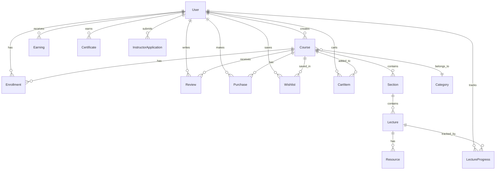

# Database Schema

Learnify uses PostgreSQL with Prisma ORM.

## Entity Relationship Diagram



## Enums

```prisma
enum UserRole {
  STUDENT
  INSTRUCTOR
  ADMIN
}

enum CourseLevel {
  BEGINNER
  INTERMEDIATE
  ADVANCED
  ALL_LEVELS
}

enum CourseStatus {
  DRAFT
  PENDING_REVIEW
  PUBLISHED
  REJECTED
  ARCHIVED
}

enum LectureType {
  VIDEO
  TEXT
  QUIZ
}

enum PurchaseStatus {
  PENDING
  COMPLETED
  REFUNDED
  FAILED
}

enum PayoutStatus {
  PENDING
  PROCESSING
  COMPLETED
  FAILED
}

enum ApplicationStatus {
  PENDING
  APPROVED
  REJECTED
}
```

## Models

### User

The central user model with role-based access and Stripe integration.

```prisma
model User {
  id            String    @id @default(cuid())
  email         String    @unique
  emailVerified DateTime?
  password      String?
  name          String?
  image         String?
  bio           String?   @db.Text
  headline      String?
  role          UserRole  @default(STUDENT)

  website  String?
  twitter  String?
  linkedin String?
  youtube  String?

  stripeCustomerId       String? @unique
  stripeConnectAccountId String? @unique
  stripeConnectOnboarded Boolean @default(false)

  // Relations
  courses      Course[]
  earnings     Earning[]
  enrollments  Enrollment[]
  progress     LectureProgress[]
  reviews      Review[]
  wishlist     Wishlist[]
  cartItems    CartItem[]
  purchases    Purchase[]
  certificates Certificate[]
  instructorApplications InstructorApplication[]
}
```

### Course

Courses created by instructors. Uses `Decimal` for price fields.

```prisma
model Course {
  id          String  @id @default(cuid())
  title       String
  slug        String  @unique
  subtitle    String?
  description String? @db.Text

  thumbnail       String?
  previewVideoUrl String?

  price         Decimal  @default(0) @db.Decimal(10, 2)
  discountPrice Decimal? @db.Decimal(10, 2)
  isFree        Boolean  @default(false)

  level    CourseLevel @default(ALL_LEVELS)
  language String      @default("English")

  learningOutcomes String[]
  requirements     String[]
  targetAudience   String[]

  status          CourseStatus @default(DRAFT)
  publishedAt     DateTime?
  rejectionReason String?

  totalDuration Int     @default(0)
  totalLectures Int     @default(0)
  totalStudents Int     @default(0)
  averageRating Decimal @default(0) @db.Decimal(2, 1)
  totalReviews  Int     @default(0)

  isFeatured    Boolean @default(false)
  featuredOrder Int?

  // Relations
  instructor   User     @relation(fields: [instructorId])
  instructorId String
  category     Category @relation(fields: [categoryId])
  categoryId   String
  sections     Section[]
  enrollments  Enrollment[]
  reviews      Review[]
  wishlist     Wishlist[]
  cartItems    CartItem[]
  purchases    Purchase[]
}
```

### Category

Course categorization with icon support.

```prisma
model Category {
  id          String  @id @default(cuid())
  name        String  @unique
  slug        String  @unique
  description String?
  icon        String?

  courses Course[]
}
```

### Section & Lecture

Course content organization. Lectures support VIDEO, TEXT, and QUIZ types.

```prisma
model Section {
  id          String  @id @default(cuid())
  title       String
  description String?
  position    Int

  course   Course    @relation(fields: [courseId])
  courseId  String
  lectures Lecture[]
}

model Lecture {
  id          String      @id @default(cuid())
  title       String
  description String?     @db.Text
  type        LectureType @default(VIDEO)
  position    Int

  videoUrl      String?
  videoDuration Int?
  videoPublicId String?   // Cloudinary public ID for deletion

  content       String? @db.Text  // Quiz JSON or text content

  isFreePreview Boolean @default(false)

  section   Section     @relation(fields: [sectionId])
  sectionId String
  resources Resource[]
  progress  LectureProgress[]
}
```

### Resource

Downloadable files attached to lectures.

```prisma
model Resource {
  id   String  @id @default(cuid())
  name String
  type String
  url  String
  size Int?

  lecture   Lecture @relation(fields: [lectureId])
  lectureId String
}
```

### Enrollment & LectureProgress

Student enrollment and per-lecture progress tracking.

```prisma
model Enrollment {
  id             String    @id @default(cuid())
  progress       Int       @default(0)    // Percentage 0-100
  completedAt    DateTime?
  lastAccessedAt DateTime?

  user     User   @relation(fields: [userId])
  userId   String
  course   Course @relation(fields: [courseId])
  courseId  String

  @@unique([userId, courseId])
}

model LectureProgress {
  id              String  @id @default(cuid())
  isCompleted     Boolean @default(false)
  watchedDuration Int     @default(0)
  lastPosition    Int     @default(0)    // Video resume position in seconds
  completedAt     DateTime?

  user      User    @relation(fields: [userId])
  userId    String
  lecture   Lecture  @relation(fields: [lectureId])
  lectureId String

  @@unique([userId, lectureId])
}
```

### Review

Student reviews with instructor response support.

```prisma
model Review {
  id      String  @id @default(cuid())
  rating  Int     // 1-5
  comment String? @db.Text

  response    String?   @db.Text   // Instructor response
  respondedAt DateTime?

  isApproved Boolean @default(true)
  isFeatured Boolean @default(false)

  user     User   @relation(fields: [userId])
  userId   String
  course   Course @relation(fields: [courseId])
  courseId  String

  @@unique([userId, courseId])
}
```

### Wishlist (Favourites)

Backs the favourites feature. DB model is named `Wishlist` but the UI uses "favourites" terminology.

```prisma
model Wishlist {
  id String @id @default(cuid())

  user     User   @relation(fields: [userId])
  userId   String
  course   Course @relation(fields: [courseId])
  courseId  String

  @@unique([userId, courseId])
}
```

### CartItem

Shopping cart for multi-course checkout. Items are cleared after successful purchase.

```prisma
model CartItem {
  id        String   @id @default(cuid())
  createdAt DateTime @default(now())

  user     User   @relation(fields: [userId])
  userId   String
  course   Course @relation(fields: [courseId])
  courseId  String

  @@unique([userId, courseId])
}
```

### InstructorApplication

Students apply to become instructors. Admins review and approve/reject.

```prisma
model InstructorApplication {
  id        String            @id @default(cuid())
  headline  String
  bio       String            @db.Text
  status    ApplicationStatus @default(PENDING)
  adminNote String?           @db.Text

  user         User   @relation(fields: [userId])
  userId       String
  reviewedBy   User?  @relation("ReviewedApplications", fields: [reviewedById])
  reviewedById String?

  @@index([userId])
  @@index([status])
}
```

### Certificate

```prisma
model Certificate {
  id            String   @id @default(cuid())
  certificateId String   @unique
  issuedAt      DateTime @default(now())

  courseName     String
  instructorName String

  user    User   @relation(fields: [userId])
  userId  String
  courseId String
}
```

### Purchase & Earning

Payment records with 70/30 revenue split.

```prisma
model Purchase {
  id String @id @default(cuid())

  amount            Int   // In cents
  platformFee       Int   // 30% platform fee
  instructorEarning Int   // 70% instructor share

  stripePaymentIntentId String? @unique
  stripeSessionId       String?
  status                PurchaseStatus @default(PENDING)

  courseName  String
  coursePrice  Decimal @db.Decimal(10, 2)

  user     User   @relation(fields: [userId])
  userId   String
  course   Course @relation(fields: [courseId])
  courseId  String
}

model Earning {
  id     String @id @default(cuid())
  amount Int

  periodStart DateTime
  periodEnd   DateTime

  payoutStatus     PayoutStatus @default(PENDING)
  stripeTransferId String?
  paidAt           DateTime?

  user   User   @relation(fields: [userId])
  userId String
}
```

### PlatformSettings

Configurable platform-wide settings.

```prisma
model PlatformSettings {
  id                 String  @id @default(cuid())
  platformFeePercent Int     @default(30)
  minCoursePrice     Decimal @default(0) @db.Decimal(10, 2)
  maxCoursePrice     Decimal @default(999.99) @db.Decimal(10, 2)
}
```

## Database Commands

```bash
# Generate Prisma Client
npx prisma generate

# Push schema to database
npm run db:push

# Run migrations
npm run db:migrate

# Seed database
npm run db:seed

# Open Prisma Studio
npm run db:studio

# Reset database
npx prisma db push --force-reset
```
