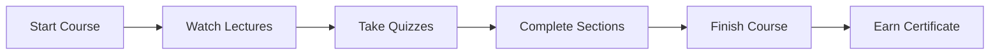

# Student Features

Learnify provides a comprehensive learning experience for students.

## Course Discovery

### Browse Courses

Students can browse all available courses with powerful filtering options:

- **Category Filter** - Filter by course category
- **Level Filter** - Beginner, Intermediate, Advanced
- **Price Filter** - Free and paid courses
- **Search** - Full-text search across course titles and descriptions

### Course Details

Each course page includes:

- Course description and objectives
- Instructor information
- Course curriculum (sections and lectures)
- Student reviews and ratings
- Price and enrollment button

## Learning Experience

### Video Player

- Seamless video playback powered by Cloudinary
- Progress tracking - resume where you left off
- Keyboard shortcuts for navigation

### Quizzes

- Multiple choice and multiple select questions
- Automatic grading with score display
- Open-ended questions (not auto-graded)
- Retry support with configurable passing scores

### Progress Tracking

Students can:

- See overall course completion percentage
- Track individual lecture completion
- Resume from last watched lecture (video position saved)
- View learning history

## Course Management

### My Courses

The student dashboard shows:

- Enrolled courses with progress
- Continue learning buttons
- Completion certificates

### Favourites

- Save courses for later with the favourite button
- Browse saved courses on the favourites page
- Quick enroll or add to cart from favourites
- Optimistic UI toggling across pages

### Shopping Cart

- Add multiple courses to cart
- View cart preview via dropdown in header
- Dedicated cart page with full details
- Multi-course Stripe checkout
- Cart items cleared after successful purchase

## Reviews & Ratings

Students can review courses they are enrolled in:

- Leave a star rating (1-5)
- Write a detailed review comment
- One review per course per student
- Rating summary with breakdown by star level
- Paginated review list on course detail page
- Instructors can respond to reviews

## Certificates

Certificates auto-generate when course progress reaches 100%:

- Digital completion certificate
- Auto-generated on course completion
- Unique verification code
- Downloadable from certificates page
